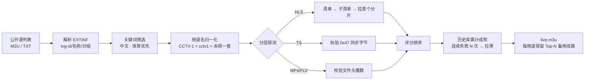

# IPTV 直播源自动采集 · 检测 · 剔除 · 发布

自动聚合公开直播源 → **真实拉流验证** → 剔除失效源 → 生成标准 M3U，供安卓 TV / PotPlayer 订阅。
本机可跑，也能交给 GitHub Actions 每 6 小时自动更新并发布到 Pages，电视端订阅一个固定网址即可。

---

## 一、它解决了什么问题

网上公开的 IPTV 列表最大的痛点是：**80% 的源是死的**。只做「域名能不能连通」的检测毫无意义，
因为大量失效源会返回 `HTTP 200` + 一个门户网页。

本项目的核心是**分层深检**：



**关键判定规则**：

| 情况 | 判定 |
|---|---|
| HLS 清单拿到了，但第一个分片拉不下来 | ❌ 失效 |
| 返回 `200` 但 `Content-Type: text/html` | ❌ 失效 |
| TS 流前 64KB 里找不到 `0x47` 同步字节 | ❌ 失效 |
| MP4 缺少 `ftyp` 头 / FLV 缺少 `FLV` 头 | ❌ 失效 |
| 分片能正常下载且 > 1KB | ✅ 可用 |

---

## 二、快速开始

### 1. 安装依赖

```powershell
python -m pip install -r requirements.txt
```

> 只依赖 `httpx` 和 `PyYAML`。HLS 解析是项目自带实现的，不依赖第三方 m3u8 库，
> 因此在 Python 3.10 ~ 3.14 上都能直接装好。

### 2. 跑一次完整流程

```powershell
python main.py run
```

或者直接双击 `run.bat`。

跑完会在 `output/` 下生成：

| 文件 | 用途 |
|---|---|
| **`live.m3u`** | ★ 主文件，每个频道保留评分最高的 3 条线路，**给电视订阅这个** |
| `live_full.m3u` | 全部验证可用的源（不裁剪） |
| `live.txt` | 纯 URL 列表，方便手工挑单个链接测试 |
| `index.html` | 网页版总览面板（含一键直连测试） |
| `report.md` | 本次检测报告：存活率、分组统计、优质线路排行 |
| `stats.json` | 运行快照，便于排查 |

### 3. 用 PotPlayer 验证（本机）

两种方式，任选：

**方式 A — 直接打开文件**

双击 `output/live.m3u`，或在 PotPlayer 里 `F3` → 打开播放列表 → 选择该文件。
左侧会按「央视 / 卫视 / 港澳台 / 体育 …」分组，双击某个频道即可播放。

**方式 B — 通过局域网地址打开（更接近电视的真实使用场景）**

```powershell
python main.py serve        # 或双击 serve.bat
```

输出示例：

```
PotPlayer / 本机测试：
  订阅地址 : http://127.0.0.1:8899/live.m3u
安卓 TV / 手机（同一局域网）：
  订阅地址 : http://192.168.1.23:8899/live.m3u
```

在 PotPlayer 里 `Ctrl+U` 粘贴 `http://127.0.0.1:8899/live.m3u` 即可。
服务已强制 `Cache-Control: no-store`，重新检测后电视端刷新就能看到最新列表，不会被缓存坑到。

---

## 三、安卓 TV 使用

支持订阅 M3U 的播放器都可以直接用：

| 播放器 | 添加方式 |
|---|---|
| **TiviMate** | 添加播放列表 → M3U 播放列表 → 输入下方订阅地址 |
| **OTT Navigator** | 播放列表 → 添加 → M3U URL |
| **Kodi** | PVR IPTV Simple Client 插件 → M3U Play List URL |
| 电视家 / 火星直播等 | 自定义源 → 填订阅地址 |

**方式一：局域网订阅（最省事）**

电脑上跑 `python main.py serve`，电视上填 `http://电脑IP:8899/live.m3u`。
记得把电脑 IP 设为静态（或在路由器做 DHCP 绑定），并且电脑要开机。

**方式二：GitHub Pages 订阅（推荐长期使用）**

见下一节。电脑不用开机，电视随时能拉到最新列表。

---

## 四、GitHub Actions 全自动更新

推送到 GitHub 后，`.github/workflows/update.yml` 会：

1. 每 6 小时（UTC `17 */6 * * *`）自动跑一次，也支持手动触发
2. 把 `data/history.json`（历史战绩）和 `output/`（结果）提交回仓库
3. 部署到 GitHub Pages

**关键点：一定要用 Pages 的地址，不要用 `raw.githubusercontent.com`。**
实测后者在部分网络下会间歇性连不上，而 `*.github.io` 稳定得多。

订阅地址格式：

```
https://<你的用户名>.github.io/<仓库名>/live.m3u
```

> **首次使用必须手动做两件事，缺一不可：**
>
> 1. **仓库必须是 Public**。GitHub Pages 在私有仓库上需要付费账号（Pro / Team / Enterprise），
>    Free 账号的私有仓库无法启用 Pages。改法：
>    `Settings → General → 拉到底部 Danger Zone → Change visibility → Public`
> 2. **启用 Pages**：`Settings → Pages → Build and deployment → Source` 选择 **GitHub Actions**
>
> 第 2 步**没法用 workflow 自动完成**。虽然 `actions/configure-pages` 有个 `enablement: true`
> 参数，但创建 Pages 站点需要管理员权限，Actions 自带的 `GITHUB_TOKEN` 会直接报
> `Resource not accessible by integration`。所以这次点击是省不掉的。
>
> workflow 里加了一步前置检查，如果 Pages 没开，它会直接告诉你该点哪里，不会让你对着
> `HttpError: Not Found` 猜。
>
> 顺带一提，仓库设为 Public 后 Actions 分钟数不计费（私有仓库才吃 2000 分钟/月的免费额度）。

因为 `data/history.json` 会一起提交，**每次运行都在上一次的战绩基础上做判断**，
失效源会持续累积失败次数直至被拉黑，稳定源则越用越靠前。

### 关于「推送撞车」

流水线跑完会自动把结果 commit 回仓库。如果你**同时**在本机手动 `git push`，
两者会撞车（`! [rejected] main -> main (fetch first)`）。

workflow 里已经做了处理：推送被拒时会自动 `git fetch` + `git rebase -X theirs` 后重试，
最多 3 次。所以正常情况下你不需要管它，只管在本机正常 `git push` 即可。

另外 workflow 只会提交 `output/`、`data/history.json`、`data/last_run.json`。
`data/raw.json` 和 `data/probed.json` 是中间产物，不进仓库。

---

## 五、自动剔除 / 自动复活机制

`data/history.json` 记录了每条 URL 的成功/失败次数：

```json
{
  "http://example.com/cctv1.m3u8": {
    "ok_count": 37,
    "fail_count": 0,
    "fail_streak": 0,
    "last_ok": "2026-10-01T12:00:00+00:00",
    "latency_ms": 218.4,
    "blacklist_until": ""
  }
}
```

- **连续失败 `blacklist_after`（默认 4）次** → 打上 `blacklist_until`，之后不再浪费时间去探测
- **冷却 `blacklist_hours`（默认 72）小时** → 自动解除黑名单重新探测，源修好了会自动复活
- 连续失败会被扣分，即使没到拉黑线，排位也会掉到备用线路后面
- 超过 `keep_days`（默认 60 天）没出现的记录会被清理

想手动重置：`python main.py reset -y`

### 断崖保护

网络抽风时可用源会骤降。如果某次检测出的频道数不到上次的 `min_keep_ratio`
（默认 50%），程序会**拒绝覆盖** `output/` 里的文件并打印提示：

```
[保留旧文件] 本次仅 6 个频道，不到上次 263 个的 50%
        为免把电视上的好列表冲掉，本次不覆盖输出。
```

这样即使某次跑失败，电视上的订阅列表也不会被清空。确认要写入就加 `--force`：

```powershell
python main.py run --force
```

---

## 六、配置说明（`config/config.yaml`）

改完配置直接重跑，不需要动代码。

### 采集源

```yaml
sources:
  - name: iptv-org-cn
    url: https://iptv-org.github.io/iptv/countries/cn.m3u
    enabled: true
    filter: all          # all=这个源的频道全都要；include=按关键词筛
```

- 默认启用了 iptv-org 的中国大陆/香港/台湾/澳门、体育分类、中文语言共 6 个源
- `url` 也支持**本地文件路径**，可以填自己整理的清单
- 社区聚合源（`raw.githubusercontent.com`、`live.fanmingming.com`）**默认关闭**，
  这两个域名在本机实测连不上，但 GitHub Actions 的出口网络通常可以，需要时改 `enabled: true`
- 想全量收录，把 `iptv-org-index` 打开即可（一万多频道，本机跑要十几分钟）

> **`filter: all` 很重要**：iptv-org 的 `countries/cn.m3u` 用的是英文频道名
> （`Beijing Satellite TV`、`Hunan TV`），源本身已经是「中文频道」范围，
> 再用中文关键词去卡它只会把整个源全部误杀。所以国家/语言类源一律写 `filter: all`，
> 只有 `index.m3u` 这种跨国家的全量源才需要靠关键词筛。

### 中文频道名自动本地化

程序内置了英文 → 中文的频道名映射，`Beijing Satellite TV` 会自动变成 **北京卫视**，
`Hunan TV` → **湖南卫视**，`Dragon TV` → **东方卫视**，`TVB Jade` → **翡翠台**。

这带来两个好处：

1. 电视上显示的是中文台名，不用看一堆英文
2. 同一个频道的英文写法（来自 iptv-org）和中文写法（来自别的源）会被归并成**同一频道的多条备用线路**，
   而不是两个重复频道

映射表在 `src/iptv/normalize.py` 的 `_PROVINCE_EN` / `_EN2ZH_EXACT`，想补充直接加即可。

### 筛选范围

```yaml
filter:
  mode: include          # include=只留命中关键词的；all=全都要
  include_keywords: [cctv, 卫视, 体育, 翡翠, 凤凰, ...]
  exclude_keywords: [测试, test, 广告]
```

默认是「中文频道 + 体育频道优先」。想换成全量：`python main.py run --mode all`

### 调节速度与吞吐

```yaml
network:
  concurrency: 200       # 并发数，本机 200 稳；网络差就降到 50
  timeout: 8.0           # 单请求超时
  retries: 1             # 失败重试（只重试超时/连接错误，4xx 直接判死）
  max_probe: 4000        # 单次最多探测多少条，0=不限
```

命令行也能临时覆盖：

```powershell
python main.py run --concurrency 400 --max-probe 1000
```

### 输出

```yaml
output:
  max_per_channel: 3     # 每个频道保留几条备用线路
  epg_url: ""            # 有 EPG 就填，会写进 #EXTM3U x-tvg-url
```

---

## 七、命令一览

```powershell
python main.py run                      # 完整流程（最常用）
python main.py run --serve              # 跑完顺手起局域网服务
python main.py run --mode all           # 不限关键词，全量检测
python main.py run --max-probe 500      # 只探测前 500 条（调试用）
python main.py run --concurrency 400    # 提高并发
python main.py run --force              # 跳过断崖保护，强制覆盖输出
python main.py collect                  # 只采集，存成 data/raw.json
python main.py publish                  # 用上次探测结果重新生成输出（不联网）
python main.py serve                    # 只起局域网服务
python main.py stats                    # 查看历史库统计
python main.py reset -y                 # 清空历史库
```

---

## 八、Windows 定时自动更新（不用 GitHub 的话）

1. 打开「任务计划程序」→ 创建基本任务
2. 触发器：每天 / 每 6 小时
3. 操作：启动程序 → 选择 `d:\code\iptv\run.bat`
4. 若要电视随时能拉取，再配一个开机自启的 `serve.bat` 任务

---

## 九、项目结构

```
iptv/
├── main.py                     # 入口
├── config/config.yaml          # 全部可调参数
├── requirements.txt
├── run.bat / serve.bat         # Windows 一键脚本
├── src/iptv/
│   ├── collect.py              # 采集 + M3U/TXT 解析
│   ├── normalize.py            # 频道名归一化、分类、筛选
│   ├── hls.py                  # 自研极简 m3u8 解析器（零依赖）
│   ├── validate.py             # ★ 分层探测引擎（核心）
│   ├── history.py              # 历史战绩：剔除与复活
│   ├── publish.py              # 生成 M3U / 报告 / 网页
│   ├── server.py               # 局域网订阅服务
│   ├── pipeline.py             # 流程编排
│   └── cli.py                  # 命令行
├── data/                       # history.json / raw.json / probed.json
├── output/                     # 生成结果
└── tests/test_normalize.py     # 回归测试
```

---

## 十、常见问题

**Q：电视上列表是空的 / 一直转圈？**
先确认电脑和服务端在同一局域网，用手机浏览器打开 `http://电脑IP:8899/live.m3u` 看能不能下载。
Windows 防火墙首次会弹窗，记得勾选「专用网络」允许。

**Q：可用率只有 50% 左右？**
正常。公开源本来就大半是死的，能稳定留下 200+ 条可用线路已经是很好的结果。
连续跑几天后，因为历史库会持续剔除不稳定源，列表质量会明显变好。

**Q：某个频道没有？**
说明该频道所有源都没通过深检。可以在 `filter.mode` 改成 `all`、调大 `network.timeout`，
或者把自己的源加到 `sources` 里再跑一次。

**Q：体育频道在比赛日才播，平时检测不到怎么办？**
调大 `history.blacklist_hours`（比如 168 小时）可以延长拉黑冷却，避免冷门时段被误杀。

**Q：GitHub Actions 跑失败了？**
Actions 的出口网络和本机不同，部分源在那边可能不通。这是正常的，
把 `--concurrency` 降到 120（workflow 里已设置）并适当调大 `timeout` 一般就好了。

**Q：会不会下完整部电影把流量跑光？**
不会。所有请求都是**流式读取前 64KB 就主动断开**，正常一次全量检测的流量在几十 MB 级别。

---

## 免责声明

本项目仅提供**技术工具**，用于聚合网络上公开可访问的直播流地址并检测其可用性。
不存储、不转播任何内容，不提供任何破解或绕过授权的手段。
使用者应自行确认所聚合内容的合法性与适用性，并遵守当地法律法规。
