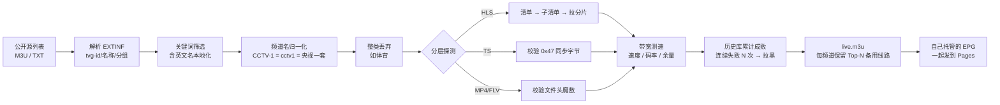
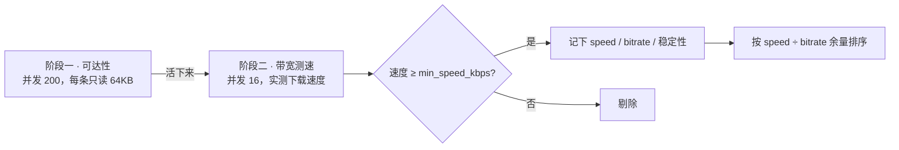
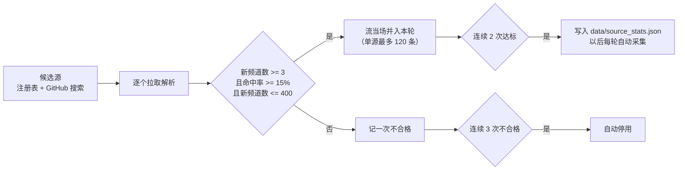

# IPTV 直播源自动采集 · 检测 · 剔除 · 发布

自动聚合公开直播源 → **真实拉流验证** → 剔除失效源 → 生成标准 M3U，供安卓 TV / PotPlayer 订阅。
本机可跑，也能交给 GitHub Actions 每 6 小时自动更新并发布到 Pages，电视端订阅一个固定网址即可。

---

## 一、它解决了什么问题

网上公开的 IPTV 列表最大的痛点是：**80% 的源是死的**。只做「域名能不能连通」的检测毫无意义，
因为大量失效源会返回 `HTTP 200` + 一个门户网页。

本项目的核心是**分层深检**：



**关键判定规则**：

| 情况 | 判定 |
|---|---|
| HLS 清单拿到了，但第一个分片拉不下来 | ❌ 失效 |
| 返回 `200` 但 `Content-Type: text/html` | ❌ 失效 |
| TS 流前 64KB 里找不到 `0x47` 同步字节 | ❌ 失效 |
| MP4 缺少 `ftyp` 头 / FLV 缺少 `FLV` 头 | ❌ 失效 |
| 分片是 WebM/Ogg/AAC 等纯音频容器 | ❌ 广播台 |
| 码率 < 400kbps 且没有分辨率声明 | ❌ 广播台 |
| 实测下载速度低于 `min_speed_kbps` | ❌ 太卡，留着也是转圈 |
| 分片能正常下载且 > 1KB | ✅ 可用 |

---

## 二、快速开始

### 1. 安装依赖

```powershell
python -m pip install -r requirements.txt
```

> 只依赖 `httpx` 和 `PyYAML`。HLS 解析是项目自带实现的，不依赖第三方 m3u8 库，
> 因此在 Python 3.10 ~ 3.14 上都能直接装好。

### 2. 跑一次完整流程

```powershell
python main.py run
```

或者直接双击 `run.bat`。

跑完会在 `output/` 下生成：

| 文件 | 用途 |
|---|---|
| **`live.m3u`** | ★ 主文件，每个频道保留评分最高的 3 条线路，**给电视订阅这个** |
| `live_full.m3u` | 全部验证可用的源（不裁剪） |
| `live.txt` | 纯 URL 列表，方便手工挑单个链接测试 |
| `index.html` | 网页版总览面板（含一键直连测试） |
| `report.md` | 本次检测报告：存活率、分组统计、优质线路排行 |
| `stats.json` | 运行快照，便于排查 |

### 3. 用 PotPlayer 验证（本机）

两种方式，任选：

**方式 A — 直接打开文件**

双击 `output/live.m3u`，或在 PotPlayer 里 `F3` → 打开播放列表 → 选择该文件。
左侧会按「央视 / 卫视 / 港澳台 / 体育 …」分组，双击某个频道即可播放。

**方式 B — 通过局域网地址打开（更接近电视的真实使用场景）**

```powershell
python main.py serve        # 或双击 serve.bat
```

输出示例：

```
PotPlayer / 本机测试：
  订阅地址 : http://127.0.0.1:8899/live.m3u
安卓 TV / 手机（同一局域网）：
  订阅地址 : http://192.168.1.23:8899/live.m3u
```

在 PotPlayer 里 `Ctrl+U` 粘贴 `http://127.0.0.1:8899/live.m3u` 即可。
服务已强制 `Cache-Control: no-store`，重新检测后电视端刷新就能看到最新列表，不会被缓存坑到。

---

## 三、安卓 TV 使用

支持订阅 M3U 的播放器都可以直接用：

| 播放器 | 添加方式 |
|---|---|
| **TiviMate** | 添加播放列表 → M3U 播放列表 → 输入下方订阅地址 |
| **OTT Navigator** | 播放列表 → 添加 → M3U URL |
| **Kodi** | PVR IPTV Simple Client 插件 → M3U Play List URL |
| 电视家 / 火星直播等 | 自定义源 → 填订阅地址 |

**方式一：局域网订阅（最省事）**

电脑上跑 `python main.py serve`，电视上填 `http://电脑IP:8899/live.m3u`。
记得把电脑 IP 设为静态（或在路由器做 DHCP 绑定），并且电脑要开机。

**方式二：GitHub Pages 订阅（推荐长期使用）**

见下一节。电脑不用开机，电视随时能拉到最新列表。

---

## 四、GitHub Actions 全自动更新

推送到 GitHub 后，`.github/workflows/update.yml` 会：

1. 每 6 小时（UTC `17 */6 * * *`）自动跑一次，也支持手动触发
2. 把 `data/history.json`（历史战绩）和 `output/`（结果）提交回仓库
3. 部署到 GitHub Pages

**关键点：一定要用 Pages 的地址，不要用 `raw.githubusercontent.com`。**
实测后者在部分网络下会间歇性连不上，而 `*.github.io` 稳定得多。

订阅地址格式：

```
https://<你的用户名>.github.io/<仓库名>/live.m3u
```

> **首次使用必须手动做两件事，缺一不可：**
>
> 1. **仓库必须是 Public**。GitHub Pages 在私有仓库上需要付费账号（Pro / Team / Enterprise），
>    Free 账号的私有仓库无法启用 Pages。改法：
>    `Settings → General → 拉到底部 Danger Zone → Change visibility → Public`
> 2. **启用 Pages**：`Settings → Pages → Build and deployment → Source` 选择 **GitHub Actions**
>
> 第 2 步**没法用 workflow 自动完成**。虽然 `actions/configure-pages` 有个 `enablement: true`
> 参数，但创建 Pages 站点需要管理员权限，Actions 自带的 `GITHUB_TOKEN` 会直接报
> `Resource not accessible by integration`。所以这次点击是省不掉的。
>
> workflow 里加了一步前置检查，如果 Pages 没开，它会直接告诉你该点哪里，不会让你对着
> `HttpError: Not Found` 猜。
>
> 顺带一提，仓库设为 Public 后 Actions 分钟数不计费（私有仓库才吃 2000 分钟/月的免费额度）。

因为 `data/history.json` 会一起提交，**每次运行都在上一次的战绩基础上做判断**，
失效源会持续累积失败次数直至被拉黑，稳定源则越用越靠前。

### 关于「推送撞车」

流水线跑完会自动把结果 commit 回仓库。如果你**同时**在本机手动 `git push`，
两者会撞车（`! [rejected] main -> main (fetch first)`）。

workflow 里已经做了处理：推送被拒时会自动 `git fetch` + `git rebase -X theirs` 后重试，
最多 3 次。所以正常情况下你不需要管它，只管在本机正常 `git push` 即可。

另外 workflow 只会提交 `output/`、`data/history.json`、`data/last_run.json`。
`data/raw.json` 和 `data/probed.json` 是中间产物，不进仓库。

---

## 五、带宽筛选 · 自动剔除 · 自动复活

### 带宽测速：解决「能打开但一直转圈」

「源可用」和「源能流畉看」是两件事。一个返回 `200`、分片也能拉到 64KB 的源，
完全可能只有 200kbps —— 打开有画面，然后一直转圈。

所以探测分两个阶段：



阶段一求「快、广」，阶段二求「准」，所以**并发必须低**。
用 200 并发去测速等于同时从 200 个服务器下载，把自己家带宽占满，
测出来每个源都只有几百 kbps —— 结论全是错的。

| 指标 | 含义 | 怎么看 |
|---|---|---|
| `speed_kbps` | 实测下载速度 | 越大越好 |
| `bitrate_kbps` | 视频本身码率 | 分片完整下完时按 `#EXTINF` 时长算，否则用清单里声明的 `BANDWIDTH` |
| `headroom` | `speed ÷ bitrate` | **<1 必卡；1~2 勉强；>2 流畉** |
| `stability` | 分片拉取成功率 | <100% 说明源不稳定 |

排序完全按 `headroom` 优先，所以「同一频道留 3 条备用线路」时，
排第一的一定是速度最宽裕的那条。`output/report.md` 和 `index.html` 里都有这一列。

#### 墙钟预算：一个踩过的坑

单条流的测速有个全局时间上限 `bw_total_timeout`。这个值**必须 ≥「拉清单 + 下完 `bw_sample_bytes`」**，
否则会出大问题：

```
内层：每个分片软超时 8s，要连测 2 个分片        -> 最坏 16s
外层：bw_total_timeout = 12s
结果：外层 asyncio.wait_for 一到点就 cancel 掉整个协程
      -> 已经下载到的字节也一起丢掉
      -> 一个完全能看的源被记成「整体超时」
```

这个 bug 实测吃掉了 **122 条流**，其中央视 26 条、卫视 26 条，
央视/卫视频道数直接腰斩。

现在的做法是**让内层自己看着 deadline 提前收工**（`validate._limit()`）：
每个 HTTP 请求的墙钟上限都被压到「剩余预算」以内，
于是外层那道 `asyncio.wait_for` 只是个永远不该触发的保险。
`tests/test_bandwidth.py` 里有针对它的回归测试。

#### 先量一下自己家的宽带

`bw_concurrency` 该填多少，取决于你这条线有多宽：

```powershell
python tools/speedtest.py        # 多源测单流速度
python tools/speedtest.py -p 6   # 6 路并发，看聚合上限
```

按「单条流平均 3 Mbps、留 4 倍余量」估：

| 宽带 | 建议 `bw_concurrency` |
|---|---|
| 50M | 8 |
| 100M | 16 |
| 200M | 24 |
| 500M+ | 32 |

> **检测所在网络会直接决定结果。** 在 GitHub Actions（美国机房）测出来的速度，
> 和你家电视实际能跑的速度不是一回事。如果在意播放质量，
> 建议在本机跑检测（见第八节），或者至少把 `min_speed_kbps` 调保守些。

### 画质档位与音轨体检

带宽够用之后，**同一条频道的多条线路按「画质 → 音轨 → 速度」排**。这两个检查都是
从流本身解出来的，不依赖源站自己声明。

**画质档位。** 评分里的分辨率是按档位给的，不是线性的：

| 分辨率 | 加分 |
|---|---|
| 2160p+ | 340 |
| 1080p | 300 |
| 720p | 200 |
| **720x576 / 480p 等标清** | **30** |
| 更低 | 0 |
| 没测出来 | 150 |

以前是 `height × 0.12`，1080p 只比 576p 高 60 分——而标清源的码率往往比高清更高，
于是标清经常被顶到第一条线路上。

**现在分辨率是第一排序键，是硬档位，不只靠加分。** 同一条频道内：

```python
(resolution_rank(height), audio_bad, -score)
#  0 = 高清（720p 及以上）或未知
#  1 = 实测非高清（720x576、480p 等）
```

这样**非高清一定排在高清后面**，不管它的码率和速度有多好。
实测确实有 720x576 的源跑到 4 Mbps，光靠「分辨率加分」压不住
「码率 + 速度」的双重加分。

`height=0`（没解出分辨率）**不当作非高清**：fMP4 / HEVC 之类容器本来就解不出
SPS，而 HEVC 源几乎都是 4K，误降权的损失比收益大。

**分辨率是真解出来的。** HLS 主清单里带 `RESOLUTION` 的源实测只有 **9.6%**
（197 条可用流里只有 19 条），剩下九成光看清单根本不知道是 1080p 还是 720x576。
所以探测时会在第一个分片里找 H.264 的 **SPS**（NAL 类型 7），
按语法解出 `pic_width_in_mbs_minus1` / `pic_height_in_map_units_minus1`，
再减掉 `frame_cropping`（1080 不是 16 的倍数，必须靠裁剪才还原得回来）。

**音轨体检。** IPTV 头端偶尔会推出「音轨残缺」的流：视频很漂亮、跑分很高，
但音轨只有二十几 kbps，解出来是一路唦唦的噪音。

实测案例（**同一家源的两个频道**）：

| 频道 | 音轨码率 | 平均帧长 | 结果 |
|---|---|---|---|
| CCTV-5 | 136.2 kbps | 363 B | 正常 |
| **CCTV-5+** | **23.8 kbps** | **63.5 B** | 听着是噪音 |

两者视频都在 2.9 Mbps 上下，光看视频码率根本挑不出来。

做法：解析 TS 的 PAT/PMT 拿到音轨 PID，数一遍各 PID 的包数，
用「整条流码率 × 音轨包占比」估出音轨码率（不需要额外测时长）。
低于 `validate.audio_min_kbps`（默认 40）就标 `audio_bad`，**发布时排到同频道的最后**——
不只是扣分，是显式降档，因为这种源的视频分往往高到扣分也压不住。
报告和索引页的音轨一列会打 ⚠。

非 TS 容器（fMP4 等）测不出来，此时给 0 分表示「未知」，**不猜、不降权**，
免得误伤一大片正常源。

> 只有**真测出低码率**才会判残缺。早期版本还把「PMT 里声明了音轨但样本里
> 一个包都没抓到」也算残缺，结果误标了 20 个正常频道
> （BBC News / France 24 / CNA / CCTV-1 …）——fMP4 这类非 TS 内容很容易
> 撞出假的 PAT/PMT。音轨是次要排序键，宁漏勿错。

### 历史战绩：自动剔除与复活

`data/history.json` 记录了每条 URL 的成功/失败次数：

```json
{
  "http://example.com/cctv1.m3u8": {
    "ok_count": 37,
    "fail_count": 0,
    "fail_streak": 0,
    "last_ok": "2026-10-01T12:00:00+00:00",
    "latency_ms": 218.4,
    "blacklist_until": ""
  }
}
```

- **连续失败 `blacklist_after`（默认 4）次** → 打上 `blacklist_until`，之后不再浪费时间去探测
- **冷却 `blacklist_hours`（默认 72）小时** → 自动解除黑名单重新探测，源修好了会自动复活
- 连续失败会被扣分，即使没到拉黑线，排位也会掉到备用线路后面
- 超过 `keep_days`（默认 60 天）没出现的记录会被清理

想手动重置：`python main.py reset -y`

### 断崖保护

网络抽风时可用源会骤降。如果某次检测出的频道数不到上次的 `min_keep_ratio`
（默认 50%），程序会**拒绝覆盖** `output/` 里的文件并打印提示：

```
[保留旧文件] 本次仅 6 个频道，不到上次 263 个的 50%
        为免把电视上的好列表冲掉，本次不覆盖输出。
```

这样即使某次跑失败，电视上的订阅列表也不会被清空。确认要写入就加 `--force`：

```powershell
python main.py run --force
```

---

## 六、配置说明（`config/config.yaml`）

改完配置直接重跑，不需要动代码。

### 采集源

```yaml
sources:
  - name: bestfan-cctv
    url: https://ghproxy.net/https://raw.githubusercontent.com/best-fan/iptv-sources/main/cn_cctv.m3u8
    enabled: true
    filter: include      # include=按关键词筛（默认）；all=这个源的频道全都要
```

默认启用的源：

| 源 | 内容 |
|---|---|
| `best-fan/iptv-sources` (`cn_cctv` / `cn_province` / `cn_all`) | 央视 1~17 全套 + 省卫视 |
| `vbskycn/iptv` (`iptv4`) | 国内直连大源，央视/卫视/地方/影视，每日更新 |
| `hujingguang/ChinaIPTV` (`cnTV1_ALL`) | 地方台合集 |
| `iptv-org` (sports / news / cn / hk / tw / zho) | 体育、国际新闻、港澳台补充 |

> **关于 ghproxy.net**：本机访问 `raw.githubusercontent.com` 会间歇性失败，
> 所以 GitHub 上的源统一走 ghproxy 镜像，同时保留直连版本作备份，
> 哪条通用哪条，重复 URL 自动去重。单个源失败不影响整体。

`url` 也支持**本地文件路径**，可以填自己整理的清单。想全量收录（一万多频道），
把 `iptv-org-index` 的 `enabled` 改成 `true` 即可。

> **筛选会先做本地化，这点很重要**。像 `iptv-org` 的 `countries/cn.m3u` 用的是
> 英文名（`Beijing Satellite TV` / `Hunan TV` / `Dragon TV`），而
> `include_keywords` 里写的是中文「卫视」。如果直接拿英文名去比，这些源一旦声明
> `filter: include`，**北京/湖南/东方/江苏/浙江/深圳卫视会被整个筛掉**
> （实测 122 条里只剩 17 条）。
>
> 所以 `normalize.matches_filter()` 会先把频道名本地化再匹配：
> `Beijing Satellite TV` → `北京卫视` → 命中「卫视」。
> 于是**所有源都可以统一用 `filter: include`**，不必再靠 `filter: all` 绕开。
> 白名单的初衷（把杂台滤掉）不受影响。

### 手工补充的频道（`config/sources/local.m3u`）

自动采集找不到、但实测可用的频道放这里。目前里面是**长春综合**
（`stream2.jlntv.cn` 上的地级市分发平台，实测约 11 Mbps）。

> 吉视把省级频道（都市/生活/影视/公共新闻/乡村/电视7/东北戏曲）换到了
> `lsfb.avap.jilintv.cn`，需要时效性 token（裸请求返回 HTTP 567），
> Referer / UA / Origin 都试过，公开拿不到；而 `stream2.jlntv.cn` 上
> **只有地级市频道，省级全是 404**。所以省级那 7 个暂时无解。
>
> 同一个文件里按注释列出了吉林其它 11 个地级市（四平/延边/松原/通化/吉林市/
> 农安/前郭/白城/集安/辽源/白山），实测**全部可用**（速度 4~24 Mbps），
> 按需求默认注释掉了。想要哪个把对应两行的 `#` 去掉即可。

### 自动源发现（每轮自动搜一遍全网）

公开源寿命短，手工列表过几个月就会大面积失效，而新源不断冒出来。
所以每轮运行会自己找一遍：

```yaml
discover:
  enabled: true
  registry: config/source_registry.yaml   # 手工候选清单
  github_search: true                     # 还去 GitHub 搜最近在更新的 IPTV 仓库
  min_new_channels: 3
  max_new_channels: 400
  max_merge_per_source: 120
  min_hit_rate: 0.15
  promote_after: 2
  demote_after: 3
  auto_enable: true
```

流程：



三个指标各自解决一个问题：

| 指标 | 防的是什么 |
|---|---|
| `min_new_channels` | 没有价值的源（都是已有频道的重复） |
| `min_hit_rate` | 全量泛列表。`iptv-org` 的 `index.country` 有 12525 条、能凑出 300 多个"新频道"，但命中率只有 **3%**；专做中文频道的列表能到 **43%** |
| `max_new_channels` | 巨型聚合列表。实测碰到过 19000 条、凑出 **967 个**新频道的。这种当轮取一部分有用，但**不设为常驻**，否则每轮都要采它、列表会被冲垮 |

自动常驻的源记在 `data/source_stats.json`（已提交进仓库，所以 CI 和本机共享同一份认知）。
想手工停用某个源，把它的 `enabled` 改成 `false` 即可。

> **CI 里会自动带上 `GITHUB_TOKEN`**，GitHub 搜索的额度从 60 次/小时提到 5000 次/小时。
> 本机没配 token 也能跑，只是额度低，超了会静默跳过。
>
> 注册表里的地址尽量用国内可达的镜像：`raw.githubusercontent.com` 实测时通时不通，
> `cdn.jsdelivr.net`（jsDelivr）可达性最好。写法：
> `https://cdn.jsdelivr.net/gh/<用户>/<仓库>@<分支>/<路径>`

### 节目单 EPG

地址写在 m3u 头部的 `x-tvg-url`，**播放器自己去拉**：

```
#EXTM3U x-tvg-url="https://bswy311.github.io/myIPTV/e.xml,https://cdn.jsdelivr.net/gh/fanmingming/live@main/e.xml"
```

> **踩过的坑：原来直接指向 `https://live.fanmingming.cn/e.xml`，但这个域名
> 实测已经连不上了（ConnectTimeout，可能改了域名或遭 DNS 污染），
> 播放器上的表现就是「节目单加载失败」。**
>
> 所以现在改成**自己托管**：每轮运行会把 EPG 下回到 `output/e.xml`
> （见 `src/iptv/epg.py`），随 `live.m3u` 一起发布到 Pages。
> 播放器取自己的域名，`*.github.io` 是已知可达的，不依赖第三方站点存活，
> 而且每轮自动更新，节目单不会变旧。
>
> 逗号后面是第三方镜像兜底，支持多个 `x-tvg-url` 的播放器会依次尝试。
>
> `output/e.xml` 已经在 `.gitignore` 里：它只发布、不提交
> （7MB 且每天都变，提交进去会让 git 历史迅速膨胀）。

```yaml
output:
  epg_url: "...自己域名/e.xml,...jsdelivr 镜像..."
  epg_self_host: true          # 是否把 EPG 下回来自己发布（推荐开着）
  epg_mirrors:                 # 按顺序尝试，第一个成功的就用
    - https://cdn.jsdelivr.net/gh/fanmingming/live@main/e.xml
    - https://ghproxy.net/https://raw.githubusercontent.com/fanmingming/live/main/e.xml
    - https://live.fanmingming.cn/e.xml
```

这份 EPG 覆盖**央视全套 + 39 个省卫视**，channel id 就是
`CCTV1` / `CCTV5+` / `北京卫视` 这种格式——程序生成的 `tvg-id` 是按这个规则
对齐的（见 `normalize.epg_id()`），所以央视和卫视两组能直接看到节目单。
上游 EPG 里没有的频道（吉林地方台、长春综合等）自然不显示节目单。

想换 EPG 改 `epg_mirrors` 即可；换成别的 EPG 往往需要同步改 `epg_id()`
的 id 规则，否则匹配不上。

### 台标

```yaml
output:
  logo_template: "https://live.fanmingming.com/tv/{id}.png"
  logo_prefer_template: true    # 央视和卫视一律用模板，避免同频道混用几套图源
```

`{id}` 就是 `tvg-id`（如 `CCTV1`）。开启 `logo_prefer_template` 后央视和卫视
统一用同一套台标，否则优先用源里自带的，只在缺失或碰到已失效图床
（`tv.haoqu99.com` 等）时才回退到模板。

### 命名与排序

- **央视**：显示为规范中文名 `CCTV-1 综合` / `CCTV-5+ 体育赛事`，
  而不是 `CCTV-1`。央视付费频道也做了中文化（`CCTV-Storm Music` → `央视风云音乐`）。
- **英文名本地化**：`Beijing Satellite TV` → `北京卫视`，`Hunan TV` → `湖南卫视`，
  `Dragon TV` → `东方卫视`，`TVB Jade` → `翡翠台`。
  好处是同一频道的英文写法和中文写法会合并成**同一频道的多条备用线路**。
- **去噪**：`[Not 24/7]`、`[Geo-blocked]` 这类上游标注不会出现在电视上；
  `HEVC`、`50 FPS` 这些变体会归并到同一频道。
- **排序**：央视按 **数字** 排（1,2,3…17，`CCTV-5+` 紧跟 `CCTV-5`），
  而不是字符串排序（否则会变成 1,10,11,12…2,3）。
  卫视按中国行政区划顺序（北京→天津→河北→…→黑龙江→上海→…）。
  认不出键的频道**排在分组末尾**，不会跑到 CCTV-1 / 北京卫视前面去。
- **分组顺序**：央视 → 卫视 → 吉林 → 长春 → 港澳台 → 国际新闻 → 其他。
  改 `output_order` 即可。吉林那组现在可能是空的（吉视官方源已改成 token 鉴权），
  但分类保留着，以后出现了新源会自动归进去。

#### 央视付费频道与 CGTN 语种

- 央视付费频道（兵器科技 / 风云剧场 / 怀旧剧场 / 第一剧场 / 台球 /
  高尔夫网球 / 世界地理 / 文化精品 / 女性时尚 / 卫生健康 / 风云音乐 / 风云足球）
  统一排在 CCTV-17 之后。它们的中文名和英文名（`CCTV-Weapon & Technology`、
  `央视怀旧剧场`、`CCTV怀旧剧场`）会归并到同一个键，不会重复出现。
- **CGTN 六个语种台分开**：英语 / 法语 / 西语 / 阿语 / 俄语 / 纪录。
  曾经因为归一化只认 `[a-z]` 后缀，中文写法（`CGTN法语`）全部退化成同一个
  `cgtn`，六个台被并成一个，电视上统一显示「CGTN法语」但点开听到的可能是英语。

### 国际新闻：为什么用「精确名单」而不是关键词

```yaml
  - name: 国际新闻
    exact:
      - BBC News
      - CNN
      - Al Jazeera English
      # ... 见 config.yaml
    keywords: []
```

需求是「只保留最主流电视台的英语频道」，这靠通配关键词做不干净：
写个 `bbc`，`BBC Earth` / `BBC Drama` / `BBC One` / `BBC Alba` 全都进来了；
写个 `cnbc`，`CNBC Awaaz` / `CNBC Arabiya` 进来了；
写个 `cnn`，`CNN TURK` / `CNN Prima News` 进来了。实测这样能捞到 **87 个**。

`exact:` 用**规范化后的完整名**比对（忽略大小写与画质标注），
`BBC News` 只匹配 `BBC News`，`BBC News Africa` 不匹配。
想增减电视台，直接改这个名单。

> 类似的子串坑还有几个，都已在注释里标了原因：
> `tvb` 会命中 `fTVBolivia`（FTV Bolivia）和 `redbulltvbr`（Red Bull TV BR）；
> `f1` 会命中 `TF1`（法一）；`jade` 会命中黎巴嫩的 `Al Jadeed`。
> 所以港澳台不再靠这些英文短词，而是靠中文词 + 本地化名
> （`TVB Jade` → 翡翠台 → 命中「翡翠」）。

### 广播台识别（重要）

广播电台也大量用 HLS 分发，速度还很快、看起来像好源，但点开只有声音没画面。
实例：`吉林乡村`（`satellitepull.cnr.cn`）实际是「吉林乡村广播」。

```yaml
validate:
  drop_audio: true
  audio_max_kbps: 400    # 视频频道不可能低于这个码率
```

识别分两道，两道都要有：

1. **容器特征**：分片是 WebM / Ogg / AAC / MP3 等纯音频格式（`sniff_audio()`）
2. **码率**：低于 `audio_max_kbps` 且没有分辨率声明

第 2 道是必需的：cnr.cn 的广播流用的是 **MPEG-TS 容器**，开头也是 `0x47`
同步字节，跟视频 TS 光看容器分不出来（实测第一道没拦住，它们的码率只有
230~236 kbps，第二道才拦住）。
判为广播的流会被剔除，并在报告里注明原因。

> 第 2 道判「有没有分辨率声明」现在更准了：清单里没写 `RESOLUTION` 的真视频流，
> 也会先从 SPS 里解出真实分辨率再判断，不会再被误当广播杀掉。

跟它配套的还有一个音轨码率下限（见第五节「画质档位与音轨体检」）：

```yaml
validate:
  audio_min_kbps: 40     # 音轨低于这个值 = 音轨残缺，排到同频道最后
```

`audio_max_kbps` 判的是「整条流是不是纯音频」（广播台），
`audio_min_kbps` 判的是「音轨本身是不是烂了」（噪音源），方向相反、别搞混。

### 地方台过滤

```yaml
filter:
  local_filter_enabled: true
  local_keep: [吉林, 长春, 吉视]     # 地方台白名单
```

有些源的 `group-title` 是 `浙江台` / `黑龙江台` / `吉林台` 这种形式，里面混了
大量县级台（「浙江上虞新闻综合频道」之类）。开了这个开关后，
**只有白名单命中的地方台会保留**，其它一律丢弃。
不想过滤就把它改成 `false`。

### 筛选范围

```yaml
filter:
  mode: include          # include=只留命中关键词的；all=全都要
  include_keywords: [cctv, cgtn, 卫视, 吉林, 长春, 翡翠, 凤凰, ...]
  exclude_keywords: [测试, test, 广告, 白城, 四平, ...]
  drop_categories: [体育]   # 整类丢弃，连探测都不做
```

想换成全量：`python main.py run --mode all`

#### 整类丢弃（`drop_categories`）

列表里的分类**既不探测也不发布**。删体育能让整轮快三分之一。
注意 `CCTV-5` / `CCTV-5+` 属于「央视」，不受影响。
分类定义本身保留着，想恢复就清空这个列表。

### 调节速度与吞吐

```yaml
network:
  concurrency: 200       # 并发数，本机 200 稳；网络差就降到 50
  timeout: 8.0           # 单请求超时
  retries: 1             # 失败重试（只重试超时/连接错误，4xx 直接判死）
  max_probe: 4000        # 单次最多探测多少条，0=不限
```

命令行也能临时覆盖：

```powershell
python main.py run --concurrency 400 --max-probe 1000
```

### 带宽测速参数

```yaml
validate:
  bw_enabled: true         # 总开关；关掉后退回「只验证能出流」（快很多，但会卡）
  bw_segments: 2           # 每个流连续拉几个分片（用来算稳定性和码率）
  bw_sample_bytes: 700000  # 每个流总共最多下载多少字节（约 0.68MB）
  min_speed_kbps: 800      # 实测速度低于此值直接剔除；嫌频道少就降到 400
  bw_concurrency: 16       # 测速并发，必须低；太大等于自己把带宽占满
  bw_total_timeout: 18     # 单条流测速的墙钟上限，见第五节
```

四个值的相互关系（改一个就得跟着改另一个）：

- `bw_total_timeout` ≥ 「拉清单 + 下完 `bw_sample_bytes`」
  （800kbps 下 700KB 约需 7s，加上拉清单给到 18s 已经很宽裕）
- `min_speed_kbps` × `bw_concurrency` 要明显小于你家宽带上限，
  否则测出来的速度会普遍偏低
- `bw_sample_bytes` 太小会把突发速度当成真实速度，太大则拖慢整轮

### 输出

```yaml
output:
  max_per_channel: 3     # 每个频道保留几条备用线路
  epg_url: ""            # 有 EPG 就填，会写进 #EXTM3U x-tvg-url
```

---

## 七、命令一览

```powershell
python main.py run                      # 完整流程（最常用）
python main.py run --serve              # 跑完顺手起局域网服务
python main.py run --mode all           # 不限关键词，全量检测
python main.py run --max-probe 500      # 只探测前 500 条（调试用）
python main.py run --concurrency 400    # 提高并发
python main.py run --force              # 跳过断崖保护，强制覆盖输出
python main.py collect                  # 只采集，存成 data/raw.json
python main.py publish                  # 用上次探测结果重新生成输出（不联网）
python main.py serve                    # 只起局域网服务
python main.py stats                    # 查看历史库统计
python main.py reset -y                 # 清空历史库
```

---

## 八、Windows 定时自动更新（不用 GitHub 的话）

1. 打开「任务计划程序」→ 创建基本任务
2. 触发器：每天 / 每 6 小时
3. 操作：启动程序 → 选择 `d:\code\iptv\run.bat`
4. 若要电视随时能拉取，再配一个开机自启的 `serve.bat` 任务

---

## 九、项目结构

```
iptv/
├── main.py                     # 入口
├── config/
│   ├── config.yaml             # 全部可调参数
│   ├── source_registry.yaml    # 自动源发现的候选清单
│   └── sources/local.m3u       # 手工补充的频道（长春综合等）
├── requirements.txt
├── run.bat / serve.bat         # Windows 一键脚本
├── src/iptv/
│   ├── collect.py              # 采集 + M3U/TXT 解析
│   ├── discover.py             # ★ 自动源发现（每轮搜新源、自动常驻/淘汰）
│   ├── normalize.py            # 频道名归一化、分类、筛选
│   ├── hls.py                  # 自研极简 m3u8 解析器（零依赖）
│   ├── h264.py                 # ★ 解 H.264 SPS 拿真实分辨率（清单里九成不声明）
│   ├── tsinfo.py               # ★ TS 体检：音轨码率 / 静音轨 / 加扰 / 分辨率
│   ├── validate.py             # ★ 分层探测 + 带宽测速 + 广播识别（核心）
│   ├── epg.py                  # ★ 抓 EPG 回来自己发布（原第三方域名已失效）
│   ├── history.py              # 历史战绩：剔除与复活
│   ├── publish.py              # 生成 M3U / 报告 / 网页
│   ├── server.py               # 局域网订阅服务
│   ├── pipeline.py             # 流程编排
│   └── cli.py                  # 命令行
├── tools/
│   ├── speedtest.py            # 量本机宽带，用来定 bw_concurrency
│   ├── tsprobe.py              # 体检某条流：音视频 PID / 音轨帧 / SPS 分辨率
│   ├── spsdump.py              # 抓真实流的 SPS 原文（给测试做固定用例）
│   └── resstats.py             # 统计已探测结果的分辨率覆盖率
├── data/                       # history.json / source_stats.json 等
├── output/                     # 生成结果（e.xml 只发布不入库）
└── tests/
    ├── test_normalize.py       # 归一化 / 筛选 / 分类回归测试
    ├── test_bandwidth.py       # 带宽测速 / 墙钟预算 / 广播识别
    ├── test_quality.py         # 画质档位 / 音轨体检 / SPS 分辨率
    └── test_epg.py             # EPG 地址与内容校验
```

---

## 十、常见问题

**Q：电视上列表是空的 / 一直转圈？**
先确认电脑和服务端在同一局域网，用手机浏览器打开 `http://电脑IP:8899/live.m3u` 看能不能下载。
Windows 防火墙首次会弹窗，记得勾选「专用网络」允许。

**Q：可用率只有 50% 左右？**
正常。公开源本来就大半是死的，能稳定留下 200+ 条可用线路已经是很好的结果。
连续跑几天后，因为历史库会持续剔除不稳定源，列表质量会明显变好。

**Q：某个频道没有？**
说明该频道所有源都没通过深检。可以在 `filter.mode` 改成 `all`、调大 `network.timeout`，
或者把自己的源加到 `sources` 里再跑一次。

**Q：体育频道在比赛日才播，平时检测不到怎么办？**
调大 `history.blacklist_hours`（比如 168 小时）可以延长拉黑冷却，避免冷门时段被误杀。

**Q：GitHub Actions 跑失败了？**
Actions 的出口网络和本机不同，部分源在那边可能不通。这是正常的，
把 `--concurrency` 降到 120（workflow 里已设置）并适当调大 `timeout` 一般就好了。

**Q：会不会下完整部电影把流量跑光？**
不会。所有请求都是**流式读取前 64KB 就主动断开**，正常一次全量检测的流量在几十 MB 级别。

---

## 免责声明

本项目仅提供**技术工具**，用于聚合网络上公开可访问的直播流地址并检测其可用性。
不存储、不转播任何内容，不提供任何破解或绕过授权的手段。
使用者应自行确认所聚合内容的合法性与适用性，并遵守当地法律法规。
